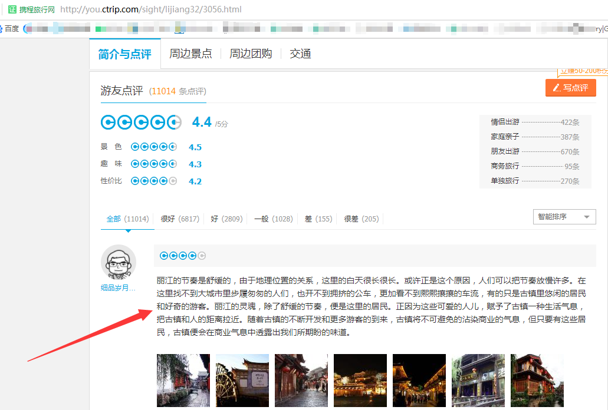
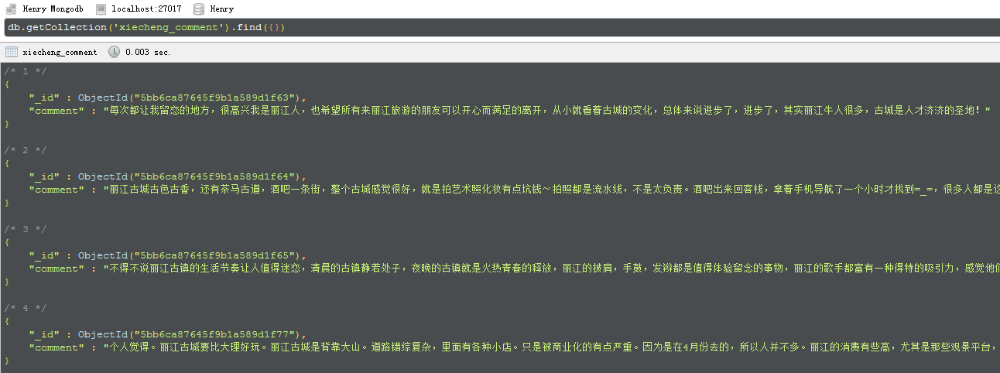
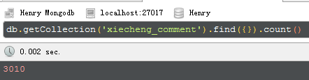

多线程Threading爬取携程的丽江古城景点评论并生成词云 
===========================
         
### 携程官网 - http://you.ctrip.com/
|Author|:sunglasses:Henryhaohao:sunglasses:|
|---|---
|Email|:hearts:1073064953@qq.com:hearts:

    
****
## :dolphin:声明
### 软件均仅用于学习交流，请勿用于任何商业用途！感谢大家！
## :dolphin:介绍
### 该项目为多线程Threading爬取携程的丽江古城景点评论并生成词云
- 项目介绍:通过爬取[携程网](http://you.ctrip.com/)中关于[丽江古城](http://you.ctrip.com/sight/lijiang32/3056.html#jieshao)景点的点评(共计3010条)，并对这些评论进行中文分词(Jieba库)及预处理，最终生成一张关于“丽江古城”的词云图(Wordcloud词云库)
- 爬虫文件:Spiders目录下的xiecheng_comment.py
- 生成词云图文件:运行Spiders目录下的comment_wordcloud.py
- 数据库配置文件:运行前修改Spiders目录下的config.py,其中为mongodb的相关配置
## :dolphin:运行环境
Version: Python3
## :dolphin:安装依赖库
```
pip3 install -r requirements.txt
```
## :dolphin:运行截图
> - 词云图


> - 携程景点评论


> - 爬取评论内容


> - 爬取评论数



